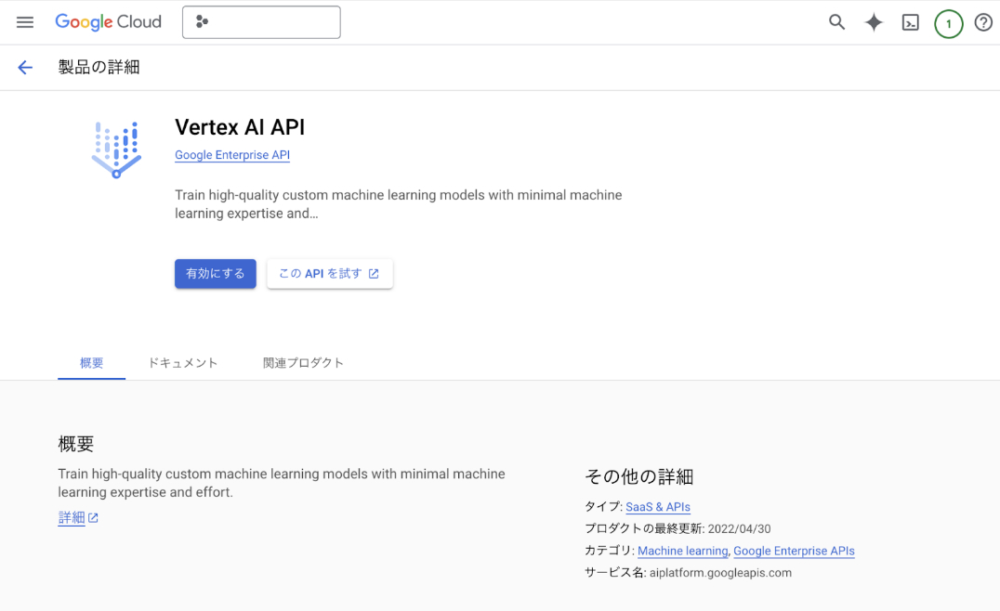
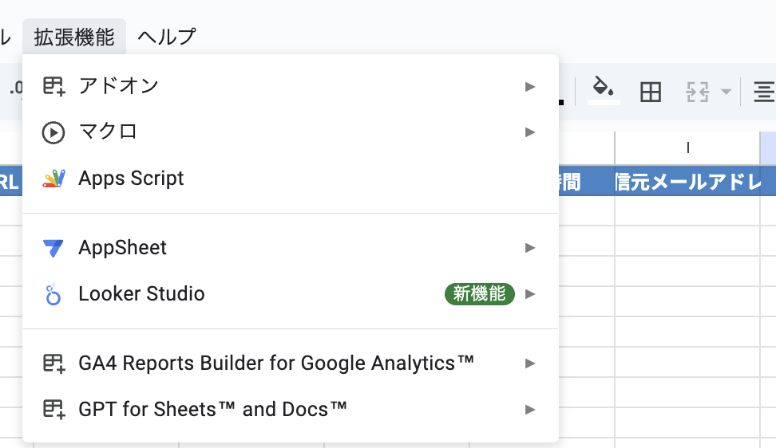
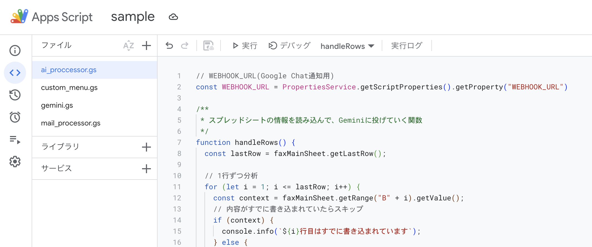
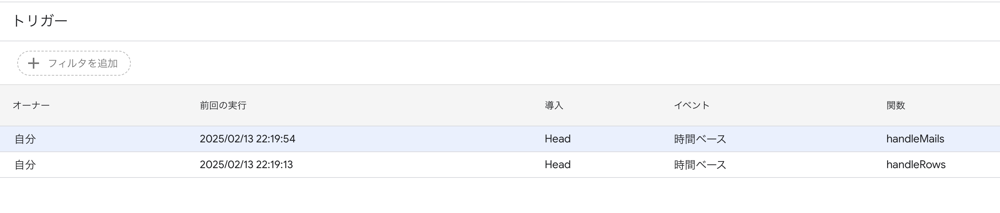
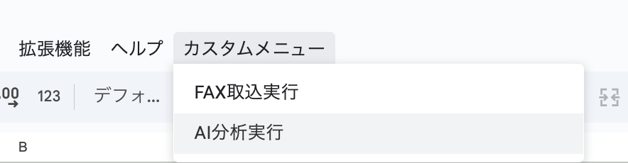
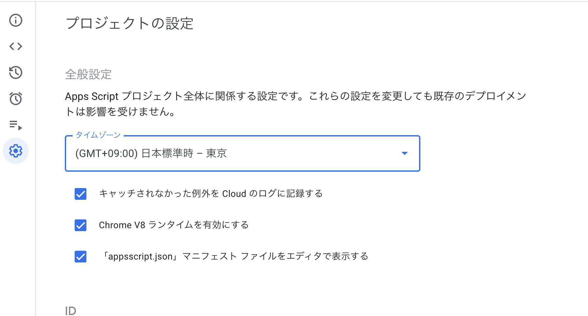

# 概要
Eメール宛に転送されてきたFAX(pdf)を、Geminiを用いて分析するためのGASプログラムです。
主に以下のサービスを利用しています。
* Google Workspace
  * Gmail
  * SpreadSheet
  * Google Drive
  * Google Apps Script
* Google Cloud
  * Vertex AI API(gemini)

# 前提条件

## Geminiについて
Google Cloud上のプロジェクトでVertex AI APIを有効にする必要があります。


> [!WARNING]
> Google Cloud上でプロジェクトを作成した場合は、課金が発生します。
> 無料枠はありますが、注意しながらご利用ください。

## Gmailについて
FAXのpdfファイルがGmailのアドレス宛に送信されてくることを前提にしています。FAX受信機等で別途設定が必要となります。

> [!NOTE]
> FAX以外でも利用できますので、試しにテストメールでpdfを送信してみることをお勧めします。

## SpreadSheetについて
スプレッドシートとGASを紐付けて、動作するようにしています。
サンプルのエクセルファイルを準備しましたので、スプレッドシートに変換してご利用ください。

> [!NOTE]
> Google Driveにファイルをアップロードすることで、スプレッドシートに変換されます

## Google Apps Script(GAS)について
各種環境変数が必要になってきます。
重要な情報はGASの[スクリプトプロパティ](https://developers.google.com/apps-script/guides/properties?hl=ja)を活用してください。


# 実装方法
## Step1: スプレッドシートを作成する
スプレッドシートを作成してください。
サンプルのエクセルファイルを参考に、4つのシートと各列にヘッダーを記入しましょう。

> [!WARNING]
> 4つのシートで構成されています。各列に情報を書き込むような仕様になっているので注意してください。(順番注意!)
>
> シート名もサンプルファイルと同一にしてください。

## Step2: 拡張機能からGASを作成
拡張機能ボタンから`Apps Script`を選択して、GASを作成しましよう。



## Step3: スクリプトの中身を作成
本レポジトリに格納しているGASを参考に、スクリプトを記述してください。
* [gemini.gs](https://github.com/koh-ysk/auto-fax-gemini/blob/main/gemini.gs)
  * Vertex AIのAPIを叩くための関数群
* [custom_menu.gs](https://github.com/koh-ysk/auto-fax-gemini/blob/main/custom_menu.gs)
  * スプレッドシート上にカスタムメニューを描画するための関数
* [mail_processor.gs](https://github.com/koh-ysk/auto-fax-gemini/blob/main/mail_processor.gs)
  * メールを監視し、情報を取得するための関数群
* [ai_processor.gs](https://github.com/koh-ysk/auto-fax-gemini/blob/main/ai_processor.gs)
  * スプレッドシートを監視し、AI分析を行うための関数群
管理上、gsファイルを分割していますが、1つのファイルで記述しても問題ありません。



### 環境変数について
以下必要な環境変数を列挙しておきます。
ご自身の環境に合わせて、設定して下さい。

- API_ENDPOINT
  - Vertex AI APIのエンドポイント
  - [詳細情報](https://cloud.google.com/vertex-ai/docs/reference/rest)
  - 例: `us-central1-aiplatform.googleapis.com`
- EMAIL_ADDRESS
  - 監視対象のメールアドレス
  - 例: `mainichi.taro@sample.com`
- FOLDER_ID
  - Google DriveのフォルダID
  - pdfファイルの格納先になります
  - 例: `1Sam4R44bofHFDNeUi3G1_dgq8Sample7A`
- LOCATION_ID
  - Vertex AIのロケーション
  - API_ENDPOINTと合わせる形で良いです
  - 例: `us-central1`
- MODEL_ID
  - Vertex AIのモデルID
  - 例: `gemini-1.5-pro-001`
- PROJECT_ID
  - Google CloudのプロジェクトID
  - 例: `sample-project`
- WEBHOOK_URL
  - WebhookのURL
  - 重要なFAXは通知が飛ぶ仕組みになっています。Google ChatやSlackと連携してください。
  - 例: `https://chat.googleapis.com/v1/spaces/sample/messages?key=sampleKey&token=sampleToken`

## GASトリガー設定
以下2つのプロセスが走るように、トリガー設定してください。
* メールを取得する
  * イベント
    * 時間ベース(時間主導型)
      * 例: 5分おき
  * 関数
    * `handleMails`
* pdfファイルを分析する
  * イベント
    * 時間ベース(時間主導型)
      * 例: 5分おき
  * 関数
    * `handleRows`

> [!IMPORTANT]
> この2つのトリガーを設定することで、プログラムが動作する仕組みになっています。

> 
>
> カスタムメニューを設定しているので、スプレッドシート上からも手動実行できます。
>
> 

> [!NOTE]
> スプレッドシートのシート`maiExecuteLog`のLastRowからGASの実行時間までに受信したメールを分析します。
>
> 初期値として、2行目に適当な時間を入力してください。
>
> 例えば、
>
> * シート`maiExecuteLog` 2行目に `2025/02/14 12:00:00`と記述
> * GASの`handleMails`が``2025/02/14 12:30:00``に実行
> 
>の場合は、30分(`2025/02/14 12:30:00 - 2025/02/14 12:00:00`)間に受信したメールを分析することができます。


## プロンプトについて
スプレッドシートの`geminiPrompt`にプロンプトを記述してください。

詳しくはエクセルを参考にしてください。

# GASの権限周りの設定について
各種APIを使用する際に、権限エラーが発生する恐れがあります。
GASの設定画面から、`appsscript.json`をファイルエディタで編集できるようにしてください。


以下の`appsscript.json`のサンプルjsonを参考にしてください。

```json
{
  "timeZone": "Asia/Tokyo",
  "dependencies": {
  },
  "exceptionLogging": "STACKDRIVER",
  "oauthScopes": [
    "https://www.googleapis.com/auth/cloud-platform",
    "https://www.googleapis.com/auth/spreadsheets",
    "https://www.googleapis.com/auth/drive",
    "https://mail.google.com/",
    "https://www.googleapis.com/auth/script.external_request"
  ],
  "runtimeVersion": "V8"
}
```

> [!WARNING]
>　ご自身の環境に合わせて設定してください。